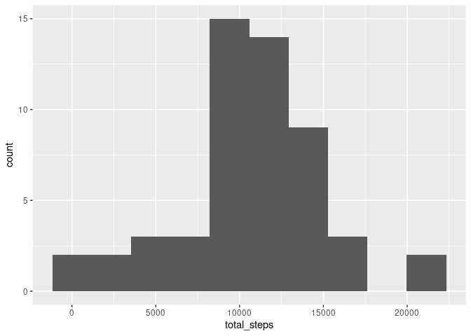

## Loading and preprocessing the data

First, we will unzip the data and read it.


```r
zip_fn = 'activity.zip'
data_fn = 'activity.csv'

unzip(zip_fn)
df <- read_csv(data_fn)

head(df)
```

```
## # A tibble: 6 × 3
##   steps date       interval
##   <dbl> <date>        <dbl>
## 1    NA 2012-10-01        0
## 2    NA 2012-10-01        5
## 3    NA 2012-10-01       10
## 4    NA 2012-10-01       15
## 5    NA 2012-10-01       20
## 6    NA 2012-10-01       25
```

```r
str(df)
```

```
## spec_tbl_df [17,568 × 3] (S3: spec_tbl_df/tbl_df/tbl/data.frame)
##  $ steps   : num [1:17568] NA NA NA NA NA NA NA NA NA NA ...
##  $ date    : Date[1:17568], format: "2012-10-01" "2012-10-01" ...
##  $ interval: num [1:17568] 0 5 10 15 20 25 30 35 40 45 ...
##  - attr(*, "spec")=
##   .. cols(
##   ..   steps = col_double(),
##   ..   date = col_date(format = ""),
##   ..   interval = col_double()
##   .. )
##  - attr(*, "problems")=<externalptr>
```

```r
summary(df)
```

```
##      steps             date               interval     
##  Min.   :  0.00   Min.   :2012-10-01   Min.   :   0.0  
##  1st Qu.:  0.00   1st Qu.:2012-10-16   1st Qu.: 588.8  
##  Median :  0.00   Median :2012-10-31   Median :1177.5  
##  Mean   : 37.38   Mean   :2012-10-31   Mean   :1177.5  
##  3rd Qu.: 12.00   3rd Qu.:2012-11-15   3rd Qu.:1766.2  
##  Max.   :806.00   Max.   :2012-11-30   Max.   :2355.0  
##  NA's   :2304
```

The dataset is read correctly and columns are in the right format. We will deal with missing values later

## What is mean total number of steps taken per day?

Let us look into distribution of total number of steps per day.


```r
total_steps <- df %>%
  group_by(date) %>%
  summarise(total_steps = sum(steps))

total_steps %>% 
  ggplot(aes(total_steps)) + 
  geom_histogram()
```

```
## `stat_bin()` using `bins = 30`. Pick better value with `binwidth`.
```

```
## Warning: Removed 8 rows containing non-finite values (stat_bin).
```

<!-- -->

Now, we compute center values (mean and median) of total steps. Since distribution is close to normal we expect them to be close.


```r
middle_values <- total_steps %>% 
  summarise(mean_steps = mean(total_steps, na.rm = T), 
            median = median(total_steps, na.rm = T))
knitr::kable(middle_values)
```


| mean_steps| median|
|----------:|------:|
|   10766.19|  10765|

## What is the average daily activity pattern?


```r
avg_daily_pattern <- df %>%
  group_by(interval) %>%
  summarise(mean_steps = mean(steps, na.rm = T))

avg_daily_pattern %>% ggplot(aes(interval, mean_steps)) +
  geom_line() +
  labs(title = 'Average daily activity', 
       x = '5-minute interval', 
       y = 'Number of steps')
```

<!-- -->


```r
max <- max(avg_daily_pattern$mean_steps)
max_int <- avg_daily_pattern %>% 
  filter(mean_steps == max) %>% 
  select(interval) %>% 
  unlist
```

On average, maximum steps (206) is are taken during 835's 5-minute interval.

## Imputing missing values

First, let us calculate how many missing values are in the dataset.


```r
na_count = sapply(df, function(x) sum(is.na(x)))
knitr::kable(na_count)
```


|         |    x|
|:--------|----:|
|steps    | 2304|
|date     |    0|
|interval |    0|
Only steps column contains missing values. There are 2304 (13.11%).

We will fill missing data with median number of steps for interval.


```r
df02 <- df %>% 
  group_by(interval) %>%
  summarise(median = median(steps, na.rm = T)) %>% 
  inner_join(df, by = 'interval') %>%
  mutate(steps = ifelse(is.na(steps), median, steps)) %>%
  select(date, interval, steps) %>%
  arrange(date, interval)
```

How imputation of missing values changes the total steps per day distribution?


```r
total_steps02 <- df02%>%
  group_by(date) %>%
  summarise(total_steps = sum(steps))

total_steps02 %>% 
  ggplot(aes(total_steps)) + 
  geom_histogram()
```

```
## `stat_bin()` using `bins = 30`. Pick better value with `binwidth`.
```

<!-- -->


```r
middle_values02 <- total_steps02 %>% 
  summarise(mean_steps = mean(total_steps, na.rm = T), 
            median = median(total_steps, na.rm = T))
knitr::kable(middle_values02)
```


| mean_steps| median|
|----------:|------:|
|   9503.869|  10395|

It skewed distribution to the left and lowered center values, especially the mean.

## Are there differences in activity patterns between weekdays and weekends?


```r
df02 <- df02 %>% 
  mutate(weekday_end = factor(if_else(wday(date) %in% c(1,7), 
                                      'weekend', 'weekday')))
wdayend_steps <- df02 %>%
  group_by(weekday_end, interval) %>%
  summarise(mean_steps = mean(steps))
```

```
## `summarise()` has grouped output by 'weekday_end'. You can override using the
## `.groups` argument.
```

```r
wdayend_steps %>% ggplot(aes(interval, mean_steps)) +
  geom_line() +
  facet_grid(weekday_end ~ .) +
  labs(title = 'Average daily activity', 
       x = '5-minute interval', 
       y = 'Number of steps')
```

<!-- -->
